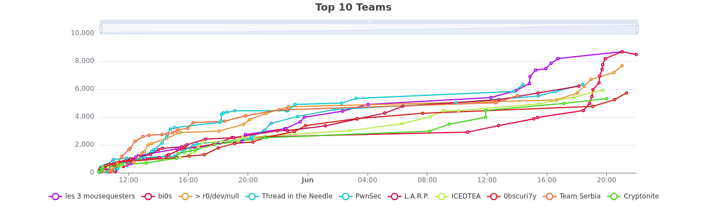

  
  <h1 style=>N0PSctf | 2025 Edition</h1>
  

     This repository encompasses the official write-ups and source code for the second edition of N0PSctf.
  

  

     
    

  

## N0PSctf 2025

The second edition of N0PSctf was hosted on **May 31st** and **June 1st**, **2025** attracting over **2,400** participants from around the globe. The competition spanned 36 intense hours, during which our participants enjoyed the journey between Cryptopia, PwnTopia and Webtopia and ended up saving our dear **n00psy** and the inhabitants of N0PSTopia.

The team **les 3 mousequesters** emerged victorious, while everyone had fun claiming their very own Topia card, thoughtfully crafted by our in-house artist, **Joe Dohn** 🃏.

This year, our goal was to make this CTF a learning opportunity for *everyone*. From beginner-friendly puzzles in Babytopia to more challenging tasks for seasoned adventurers in the rest of the Topias, we tried our best to offer our players an unforgettable journey in our cartoonish universe.

A huge [Tak](https://howtosayguide.com/how-to-say-thank-you-in-danish) for all the Tak Tak tickets 💌, we hope you had a blast playing Tetris on our virtual Game Boy and chasing digital clues across [TopiaNews](https://topianews.com) like Topian detectives to save the cute Bibzy 🐼.

  

## Categories

- 🐣​ [Baby](babytopia)
- 🔑 [Cryptography](crypto)
- 🍪 [Web](web) 
- 🕵️ [OSINT](osint) 
- ⚙️ [Reverse engineering](rev) 
- 🤓 [PWN](pwn) 
- 👽 [Miscellaneous](misc) 
- 💾 [Forensics](forensics) 

## Storyline 
Jojo needs your help again. He received an emergency call from n00psy, a fellow inhabitant of N0PStopia, a cartoonish cyberworld.

The three evil Lords of PwnTopia, CrypTopia, and WebTopia attacked N0PStopia and are now planning to extend their conquest. They MUST be stopped before it is too late!

As you saved him last year, Jojo immediately thought of you to answer the call. Will you be able to stop this threatening threat?

## Our Team 

  

## License
With the exception of the names of N0PSctf organizers and of the CTF itself, and unless another license is stated in the corresponding directory or takes precedence in any way, the content of this repository is provided under the [CC-BY-4.0 license](LICENSE).

