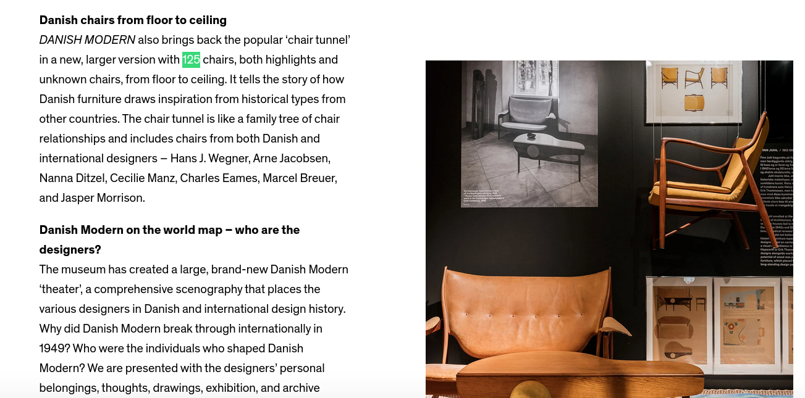

## Description 
Aloha querid@s! ^^

It's finally time to dive into the fascinating world of [OSINT](https://en.wikipedia.org/wiki/Open-source_intelligence), that magical word that excites digital detectives and gives regular folks the chills. 

Today, we’ll be starting with the baaasic stuff : just a bit of reverse image searching to warm up!

Now, story time: Alice has stumbled into N0PStopia and found herself in this surreal place, filled with chairs. 🪑 

Will you be able to figure out where it is, when it opened, and, just for fun, how many chairs are in there? It seemed like it stretches into infinity.. x) 

**Flag format : `N0PS{Location-Name_Opening-Date_chairs-number}`**  
**Example : `N0PS{Lectures-Tower-N0PSTopia_June-1st-2025_505}`**

**Author : Sto**


## Solution
First, let's start with the basics. 

We know that, sometimes, images contain metadata, including where they were taken, in the EXIF information.
Let’s check if that’s the case here, shall we?

We use [`exiftool`](https://en.wikipedia.org/wiki/ExifTool) and run the command : `$ exiftool pic.jpg` to see the output : 
```
ExifTool Version Number         : 13.10
File Name                       : pic.jpg
Directory                       : .
File Size                       : 1577 kB
File Modification Date/Time     : 2025:05:04 03:00:13+02:00
File Access Date/Time           : 2025:05:04 03:00:13+02:00
File Inode Change Date/Time     : 2025:05:04 03:00:13+02:00
File Permissions                : -rw-rw-r--
File Type                       : JPEG
File Type Extension             : jpg
MIME Type                       : image/jpeg
Image Width                     : 2448
Image Height                    : 3264
Encoding Process                : Baseline DCT, Huffman coding
Bits Per Sample                 : 8
Color Components                : 3
Y Cb Cr Sub Sampling            : YCbCr4:2:0 (2 2)
Image Size                      : 2448x3264
Megapixels                      : 8.0
```
Bad luck, we don't have any interesting metadata in our case :/

Well, let's keep moving. 

One way to perform a reverse image search is by using Google Reverse Image Search. You can directly upload the picture on [images.google.com](https://images.google.com/), which will yield similar pictures to ours. Let's try that. 


Ow, nice results, we obtain similar pictures to ours with some information about the location. 
First, one picture says it's in **Copenhagen**, and the other says that it is a **museum**. Cool! Now, we have some clues.

Let's add the information we just obtained in the Google Search. 


As highlighted in the title of the picture above, the location is the **Design Museum Denmark**! Oki, perfect.   

Now, we know that it is a picture of a place full of chairs in the Design Museum Denmark x)  

Well, there's no harm in making a google dork with those 4 keywords, right? To find websites containing the exact phrase we're searching for, the trick is to wrap the phrase in double quotes. So, our Google dork would look like this:
`"Design" "Museum" "Denmark" "Chairs"`


And what can be better than finding the [official museum page](https://designmuseum.dk/en/exhibition/danish-modern/), _with the info we are looking for_.. hihi ^^   

Let's check this page. 



We learn that this place full of chairs is named the '**Chair Tunnel**', which is part of the **Danish Modern** exhibition, and that there are **125 chairs** in it (Ow, at least now we're sure it's a finite number x) )


Allora, recap! With the information we have so far, we know that the location is **Design Museum Denmark** and that there are **125 chairs** in it. 

Vámonos chic@s! One more step to go to complete the flag, we just need to find the opening date of this crazy tunnel. As it is part of the Danish Modern exhibition, we will just need to look for the opening date of the latter. To do so, let's look for all the information related to this exhibition on the museum's official website.

We can achieve that by using the following Google dork. 
`"danish" "modern" site:designmuseum.dk`


This [link](https://designmuseum.dk/en/pressroom_danish-modern/) seems perfect as it relates to the press release (probably it contains the dates and all, sometimes, a bit of logic goes a long way ;)) 

Let's visit it. 

Aha, spotted! It opened on June 7th, 2024.

Well, what are you still waiting for? You've got all the information you need. 

Hurry, go flag !
`B4BY{Design-Museum-Denmark_June_7th_2024-125}`


_Tak [Tak](https://howtosayguide.com/how-to-say-thank-you-in-danish) ^^_

