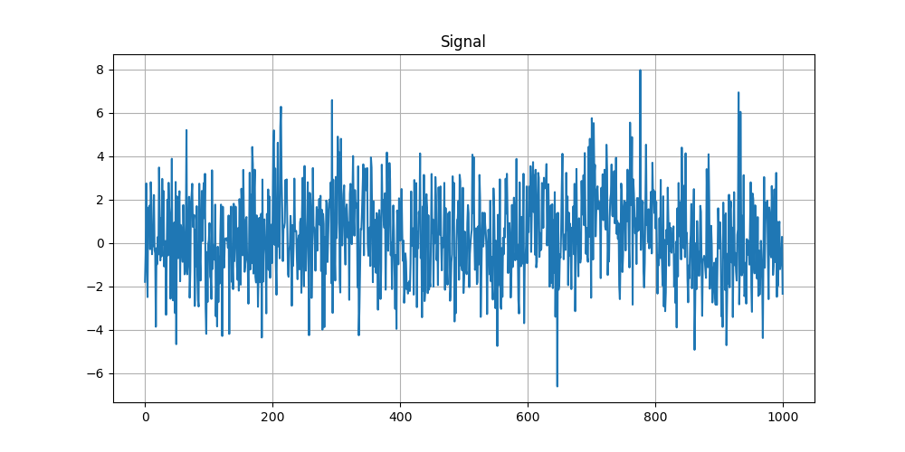
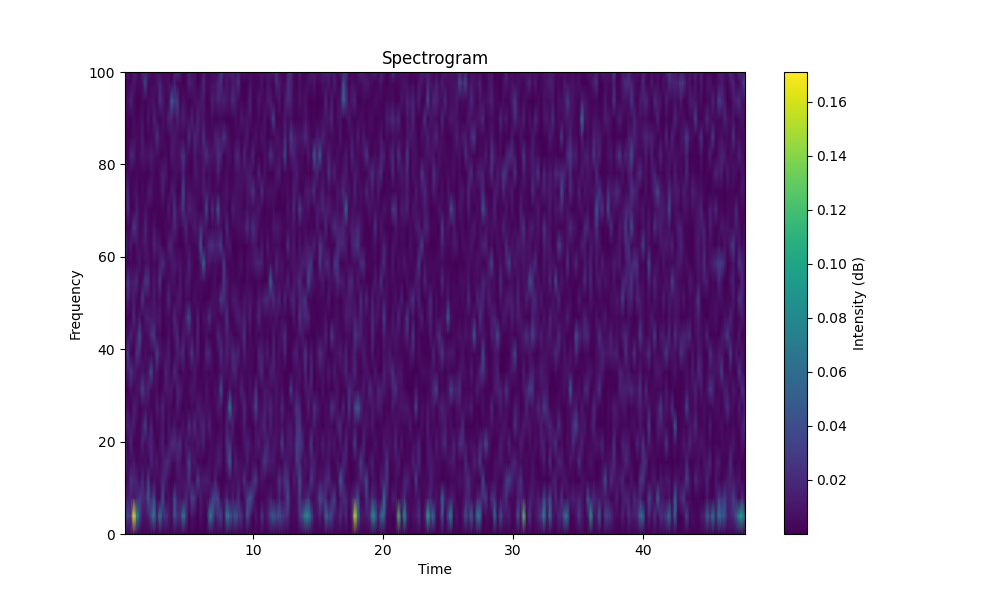
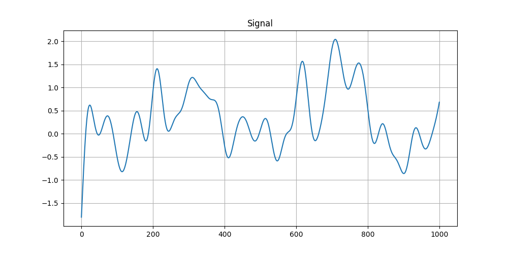

## Big Phone

### Description

A few minutes ago, a message from the evil lord of WebTopia to the other lords has been intersepted. 
He does not send a lot of them. Thus it must be important! 
But, what could it mean? 

**Author: Jusdepommes**

### Solution

You are given a text file which is a signal. We will analyze it using python.

```py
import numpy as np
import matplotlib.pyplot as plt
from scipy.signal import butter, filtfilt, spectrogram
import string

file_name = 'CTF_phone.txt'

with open(file_name, 'r') as file:
    content = file.read().split()

signal = np.array([float(x) for x in content])
```

First we can try to see what the signal looks like.

```py
fig, ax = plt.subplots(figsize=(10, 5))

ax.plot(signal[:1000])
ax.set_title('Signal')
ax.grid(True)

plt.show()
```


We can't see any pattern so we can perform a Fourier transform to see the spectrogram of the signal.

```py
fs = 1000
nperseg = 256

frequencies, times, Sxx = spectrogram(signal, fs, nperseg=nperseg)

plt.figure(figsize=(10, 6))
plt.pcolormesh(times, frequencies, Sxx, shading='gouraud')
plt.colorbar(label='Intensity (dB)')
plt.ylabel('Frequency')
plt.xlabel('Time')
plt.title('Spectrogram')
plt.ylim(0, 100)
plt.show()
```



The intensity and a pattern seem to be located below 20Hz. So we can try to apply a low pass filter to reveal the interesting part.

```py
def butter_lowpass(cutoff, fs, order=5):
    """Low pass filter"""
    nyquist = 0.5 * fs
    normal_cutoff = cutoff / nyquist
    b, a = butter(order, normal_cutoff, btype='low', analog=False)
    return b, a

def lowpass_filter(data, cutoff, fs, order=5):
    """Apply the low pass filter"""
    b, a = butter_lowpass(cutoff, fs, order=order)
    return filtfilt(b, a, data)

cutoff = 20
filtered_signal = lowpass_filter(signal, cutoff, fs)

fig, ax = plt.subplots(figsize=(10, 5))

ax.plot(filtered_signal[:1000])
ax.set_title('Signal')
ax.grid(True)

plt.show()
```



Now we can observe a binary pattern: the signal alternates between up and down every 200 points. We can convert this into a binary array and eventually decode it into ASCII.

```py
n = 200
sig = [sum(filtered_signal[x: x+n])/n for x in range(0, len(filtered_signal), n)]
m = (max(sig) + min(sig))/2
binsig = [1 if x > m else 0 for x in sig]

def binary_to_ascii(binary_array):
    binary_array = binary_array[:len(binary_array) - (len(binary_array) % 8)]
    chars = []
    for i in range(0, len(binary_array), 8):
        byte = binary_array[i:i + 8]
        byte_str = ''.join(map(str, byte))
        ascii_char = chr(int(byte_str, 2))
        chars.append(ascii_char)
    return ''.join(chars)

print(binary_to_ascii(binsig))
```

This will reveal `UUN0PS{Ju5t_h1Dd3n_1N_no153}UU`.

If you are not able to see a pattern, it is possible to brute-force the number of points making a pattern.

```py
for n in range(1,10000):
    sig = [sum(filtered_signal[x: x+n])/n for x in range(0, len(filtered_signal), n)]
    m = (max(sig) + min(sig))/2
    binsig = [1 if x > m else 0 for x in sig]
    o = binary_to_ascii(binsig)
    if "N0PS" in o and all(c in string.printable for c in o):
        print(f"{n=}, {o}")
        break
```

This will also reveal the flag: `n=200, UUN0PS{Ju5t_h1Dd3n_1N_no153}UU`

### Flag
`N0PS{Ju5t_h1Dd3n_1N_no153}` 