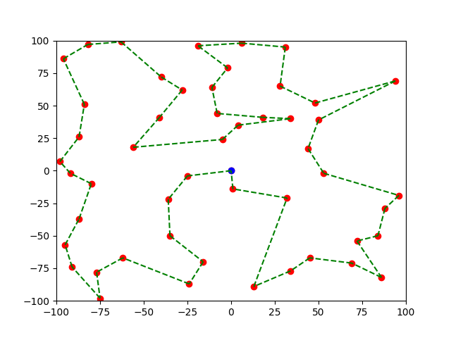

## G-Bee-S

### Description

There is a bee living in N0PStopia, named Valentine. She loves waterlilies, and lots of them are located around her beehive.
However, she needs some help to find a good way to visit all of them while tralling the shortest distance, can you help her?
She does not need the best path, but at least one that is good enough.

_Note: Each line is the coordinates of a waterlily. The beehive is located in (0,0), and the path has to start from there and end there. Each flower has to be visited one time, but not more. When submitting, you have to send the order of flowers to be visited.
For instance, if your path is to visit the 2nd flower, then the 3rd, then the 1st, you will send `0 2 3 1 0`, where 0 represents the beehive.
In order to be valid, your path has to have a total length of less than 1400._

**Author: algorab**

### Solution

This challenge is an implementation of the [travelling salesman problem](https://en.wikipedia.org/wiki/Travelling_salesman_problem). Therefore, as there are a number of 50 flowers, the naive algorithm is not sufficient to find a solution, because its complexity is $O(n!)$.

There are multiple ways to solve the problem, the one we chose was using a [genetic algorithm](https://en.wikipedia.org/wiki/Genetic_algorithm). Here is the implementation:

```python
import random
import numpy as np
import matplotlib.pyplot as plt

flowers = []

with open("flowers.txt", 'r') as f:
    for line in f.readlines():
        flowers.append((int(line.split(" ")[0]), int(line.split(" ")[1])))

num_flowers = len(flowers)

def tsp_ga(graph, results, start=0, gen_factor=2.2, pop_factor=1.6):

    # Create list of vertices
    vertex = []
    for i in range(len(graph)):
        if i != start:
            vertex.append(i)

    # Create initial population
    # Each genome is made of a tuple containing the path and its score
    population = results
    for i in range(int(len(graph)**pop_factor)):
        random.shuffle(vertex)
        permut = vertex.copy()
        current_cost = 0
        current_node = start
        for j in permut:
            current_cost += graph[current_node][j]
            current_node = j
        current_cost += graph[current_node][start]
        population.append((permut, current_cost))

    # Selection process going on
    for k in range(int(len(graph)**gen_factor)):

        # Keep only the bests
        population = list(sorted(population, key=lambda x: x[1])[:len(graph)])

        # Reproduce the bests
        while len(population) < int(len(graph)**pop_factor):
            for i in range(len(graph)):
                path_mut = population[i][0].copy()
                l = range(len(path_mut))

                # Mutation process
                num_flips = random.randrange(1,10)
                for i in range(num_flips):
                    i1, i2 = random.sample(l, 2)
                    path_mut[i1], path_mut[i2] = path_mut[i2], path_mut[i1]

                current_cost = 0
                current_node = start
                for j in path_mut:
                    current_cost += graph[current_node][j]
                    current_node = j
                current_cost += graph[current_node][start]
                population.append((path_mut, current_cost))

    return population[0]

# Create the adjacency matrix
graph = np.zeros((num_flowers+1,num_flowers+1))
dists = np.zeros(num_flowers+1)
for i in range(len(flowers)):
    dists[i+1] = np.sqrt((flowers[i][0])**2 + (flowers[i][1])**2)
graph[0] = dists
for i in range(len(flowers)):
    dists = np.zeros(num_flowers+1)
    dists[0] = graph[0][i+1]
    for j in range(len(flowers)):
        dists[j+1] = np.sqrt((flowers[j][0]-flowers[i][0])**2 + (flowers[j][1]-flowers[i][1])**2)
    graph[i+1] = dists

results = []
step = 1
results.append(tsp_ga(graph, results))
print(f"Step {step}")
path, score = list(sorted(results, key=lambda x: x[1]))[0]
print(f"Best score: {score}")
print(f"Best path: {path}")

# Run until the best score drops below 1400
while score >= 1400:
    step += 1
    results.append(tsp_ga(graph, results))
    print(f"Step {step}")
    path, score = list(sorted(results, key=lambda x: x[1]))[0]
    print(f"Best score: {score}")
    print(f"Best path: {path}")
```

With this algorithm, the best path that we were able to find was `0 18 39 16 47 50 1 41 19 4 12 21 31 42 27 25 30 23 46 22 17 8 49 5 15 34 14 29 2 11 13 48 20 35 24 10 9 32 3 26 6 44 36 43 37 28 7 40 33 38 45 0`, with a total length of about 1322.



Thanks to that, Valentine can visit all the Waterlilies <3

### Flag

`N0PS{w4t3rl1ll13s_f0r_v4l3nt1n3}`