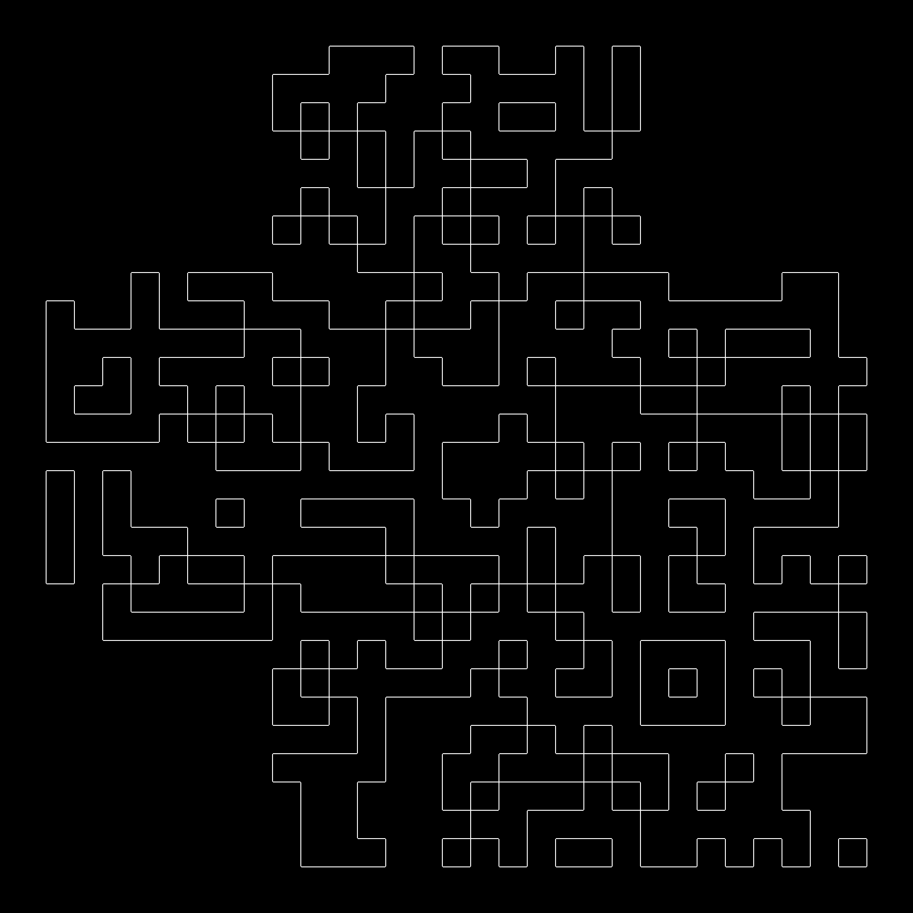

## Maze Writeup

### Description
  Later on the hike, n00psy takes you to a place he really likes: a maze!
  
  **Author: Jusdepommes**

### Solution
  This challenge is an image processing challenge. This image was created taking a QRcode, putting the laplacien filter and then we only took the amplitude on it to detect the edges and then the colors where changed and the four corners of the QRcode have been deleted to make if more feel like a Maze.

- [Identify the QRcode](#identify-the-qrcode)
- [Extract the qrcode](#extract-the-qrcode)
- [Python script](#python-script)
- [Results](#results)

#### Identify the QRcode
If you cut out the added people and you put the image in black and white you can see a QRcode edges.

#### Extract the qrcode
To get a real QRcode that is visible we can fill in the spots and change the colors.
Lets do that with an algorithm!
First you can remove the colors and get a new image (in the python code bellow this function is imbeded in the code).

Start by setting everything to white (255).
Mode toggling:

When the algorithm encounters a white pixel (255), it changes the mode.
If the current mode is "change to white," it switches to "change to black."
If the current mode is "change to black," it switches to "change to white."

Pixel alteration:

Based on the current mode, each subsequent pixel is altered.
    If the mode is "change to white," black pixels (0) are turned white (255).
    If the mode is "change to black," white pixels (255) are turned black (0).

Repeat the process across the entire image, left to right, top to bottom.
#### Python script
```python
from PIL import Image
import numpy as np

def process_image(image_path, output_path):
"""
Process a grayscale image by altering its pixels based on white-black encounters.
This alternates between converting black pixels to white or keeping them black.

Args:
    image_path (str): The path to the input image.
    output_path (str): The path to save the processed output image.
"""
# Open the image and convert it to grayscale
img = Image.open(image_path).convert('L')

# Convert to only get black and white
img_array = np.array(img)
min_pixel = img_array.min()
max_pixel = img_array.max()
threshold = (min_pixel+max_pixel)/2
img = img.point(lambda p: 255 if p > threshold else 0)

# Access the pixel data
pixels = img.load()  

# Get image dimensions
width, height = img.size

# Process the image row by row (left to right, top to bottom)
for y in range(height):
    encounters = 0  # Track transitions between white and black pixels
    consecutive_whites = 0  # Count consecutive white pixels
    
    # Process each pixel in the current row
    for x in range(width):
        pixel_value = pixels[x, y]  # Get the pixel value (0 for black, 255 for white)
        
        # Determine the current mode: alternate based on white-black encounters
        mode = encounters % 2 == 0  # True if encounters are even, False if odd
        
        # Count white pixels and handle transitions
        if pixel_value != 0:  # White or grey pixel
            consecutive_whites += 1
        elif pixel_value == 0:  # Black pixel
            if consecutive_whites > 0:
                encounters += 1  # A transition from white to black occurred
            consecutive_whites = 0  # Reset white pixel counter
        
        # Apply the mode: change black to white or leave it black
        if mode:
            pixels[x, y] = 255  # Set to white (255 in grayscale)
        else:
            pixels[x, y] = 0  # Keep as black (0 in grayscale)

# Save the modified image to the output path
img.save(output_path)

# Example usage:
input_image_path = "CTF_Maze.png"
output_image_path = "Final_QRcode.png"
process_image(input_image_path, output_image_path)

```

#### Results
**Final result of python**


Now we need to add with paint or any photo modifier the 3 corners of square needed to detect a QRcode. 


### Flag
`N0PS{7hI5_1s_R3a1Ly_4_Qr_C0d3}`