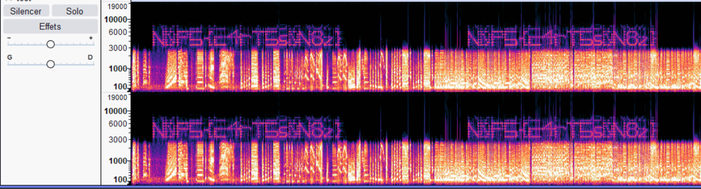
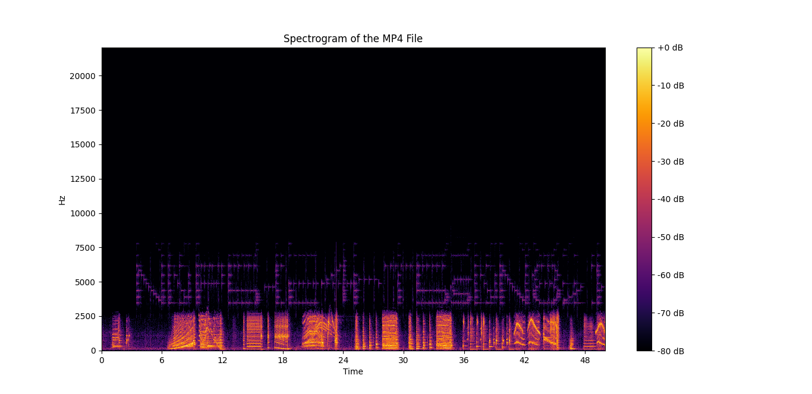

## Music Writeup

### Description
Noopsy takes you to a nature walk in N0PStopia.
On your way, you meet a group of dancing skeletons! What an amazing adventure to see and hear.
I wonder what they talk about...

**Author: Jusdepommes**

### Solution
This challenge is a signal processing challenge. Look at the waterfall of the sound.

- [Identify the notes](#identify-the-notes)
- [ Extract the notes through a waterfall](#extract-the-notes-through-a-waterfall)
- [Python script](#python-script)
- [Results](#results)

#### Identifying the notes
The notes are not able to be heard because they are too down in dB and to high in Frequency.

#### Extract the notes through a waterfall
We will look at the whole muc file in time, taking notes of the db and each frequencies. We can see it through audacity or by python.
#### Python script
Finally, we write a python script to create an image: From a point in an image of waterfall. I would recommend using Audacity so you do not have to cut many time the audio to see clearly the area you are looking for with the flag.
```python
import librosa
import librosa.display
import matplotlib.pyplot as plt
import numpy as np

audio_path = 'CTF_Dangerous_friend.mp4'
y, sr = librosa.load(audio_path, sr=None)

start_time = 85 #s
end_time = 135 #s

start_sample = int(start_time * sr)
end_sample = int(end_time * sr)
y = y[start_sample:end_sample]

S = np.abs(librosa.stft(y))
S_db = librosa.amplitude_to_db(S, ref=np.max)

plt.figure(figsize=(12, 8))
librosa.display.specshow(S_db, sr=sr, x_axis='time', y_axis='hz', cmap='inferno')
plt.colorbar(format='%+2.0f dB')
plt.title('Spectrogram of the MP4 File')
plt.show()
```

#### Results
- **Final result Audacity**

- **Final result Python**



## Flag
`N0PS{c4rT5s0N8z}`