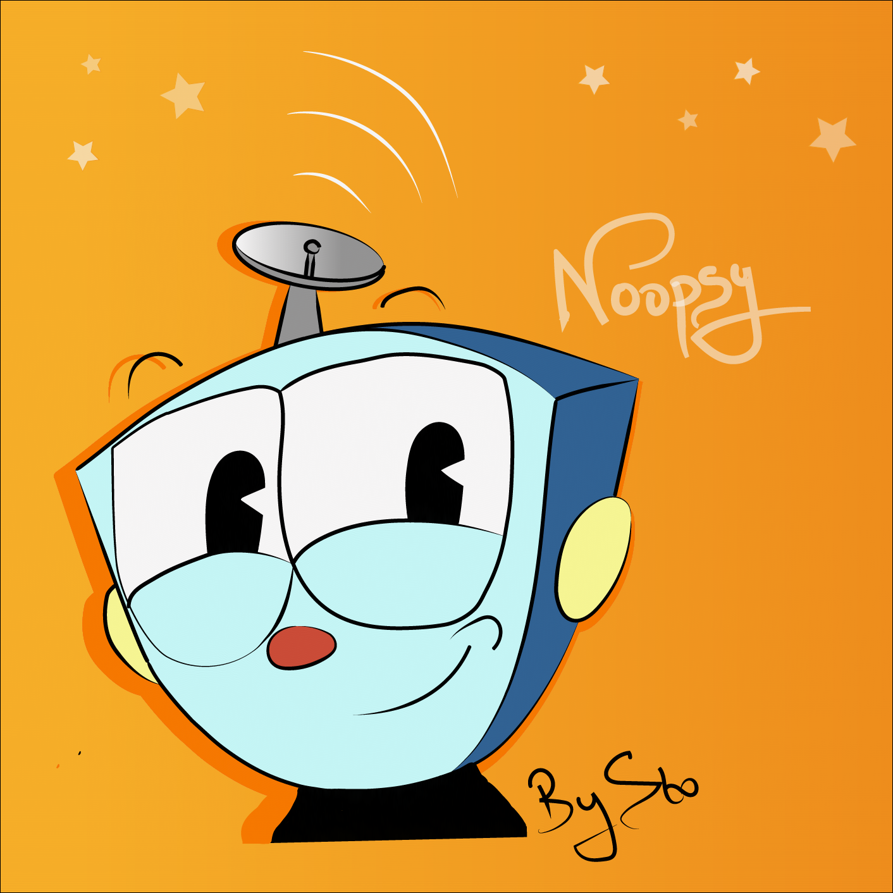
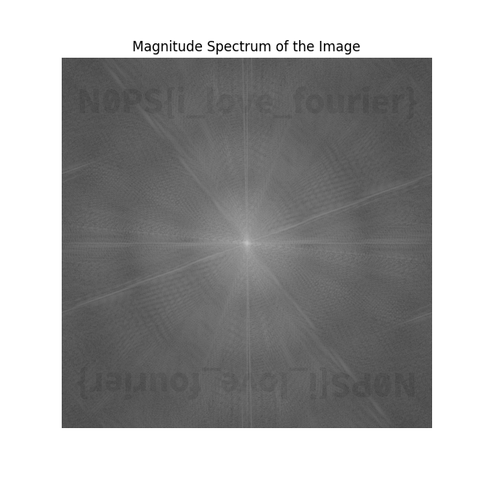

## The Great Mugman

### Description

At the end of this lovely moment, n00psy gives you a picture of him. "I will never forget this moment, thank you for coming with me!", he says. "Also, sorry if the quality of this picture is a bit poor on the edges, this is an old picture that my friend Joseph took in 1807."

**Authors: volca_ky & Jusdepommes**



### Solution

This is an image processing challenge.
We can perform a Fourier transform to get the flag.

#### Python script

```python
from PIL import Image
import numpy as np
import matplotlib.pyplot as plt

## Load the image
image_path = 'CTF_image.png'
image = Image.open(image_path)

## Convert the image to grayscale
gray_image = image.convert('L')

## Perform FFT (Fast Fourier Transform)
fft_image = np.fft.fft2(np.array(gray_image))
fft_shifted = np.fft.fftshift(fft_image)

## Calculate the magnitude spectrum
magnitude_spectrum = np.log(np.abs(fft_shifted) + 1)

## Plot the magnitude spectrum
plt.figure(figsize=(6, 6))
plt.imshow(magnitude_spectrum, cmap='gray')
plt.title('Magnitude Spectrum of the Image')
plt.axis('off')
plt.show()
```

#### Result


### Flag
`N0PS{i_love_fourier}`