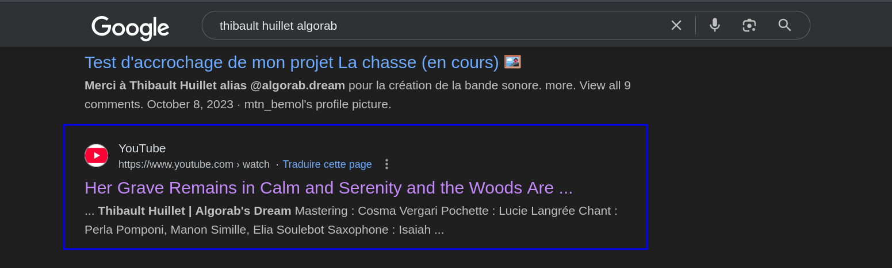
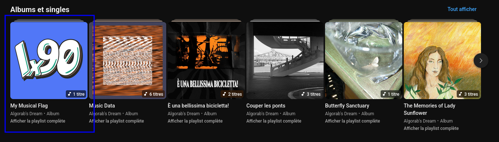

## I hear some music ..
### Description
I heard some music... Seems like one of the minds behind N0PStopia is a musician.

The flag is a chain of characters, that has to be put between `N0PS{...}`

### Solution
_(Suggested by Sto)_

The goal of this challenge is finding some music that apparently a member of the N0PSctf team composed according to the challenge description. 

Well well, let's check who are these _minds behind N0PStopia_. 
We can find the information related to the team on [N0PSctf official website](https://www.nops.re/). 

The first one on the list is **Thibault Huillet aka algorab**. 
Hmm, let's learn more about him.    

By googling "Thibault Huillet algorab", we find this [YouTube Link](https://www.youtube.com/watch?v=em4Y5--PubM).

Let's check it. It's a music piece called "Her Grave Remains in Calm and Serenity and the Woods Are Breathing" which is part of the album "The Memories of Lady Sunflower". Seems like we found our musician on the first try 👀

We also find his [youtube channel](https://www.youtube.com/channel/UCI1sIEADXO4eQHm2B5wCnGQ). Looks like there's this album with the N0PSctf logo x) 

We listen to it. First, the music is so cool, feels like the breeze of N0PStopia ^^. Besides, it contains our flag that is spelled. 

Flag : `N0PS{21b2a4131fa98bb867f31e934bfe19f3}`

--------
_FYI : [algorab](https://en.wikipedia.org/wiki/Delta_Corvi) literally means a star ✨_

