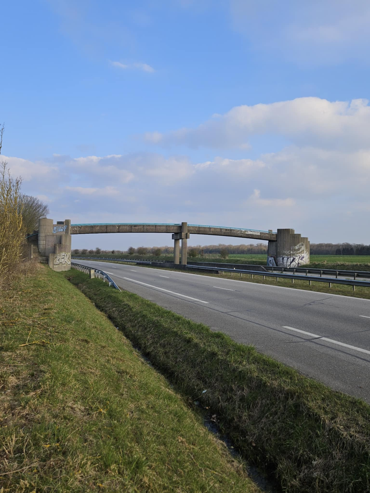
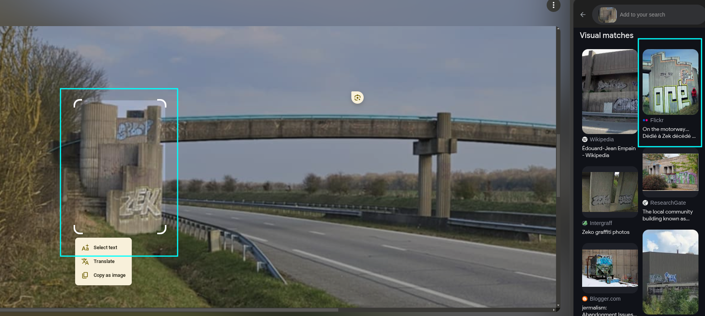
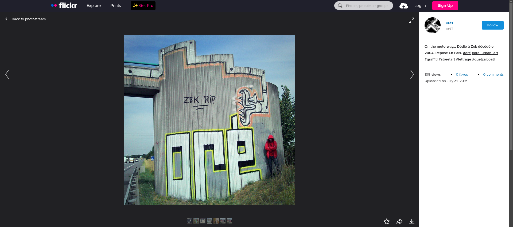
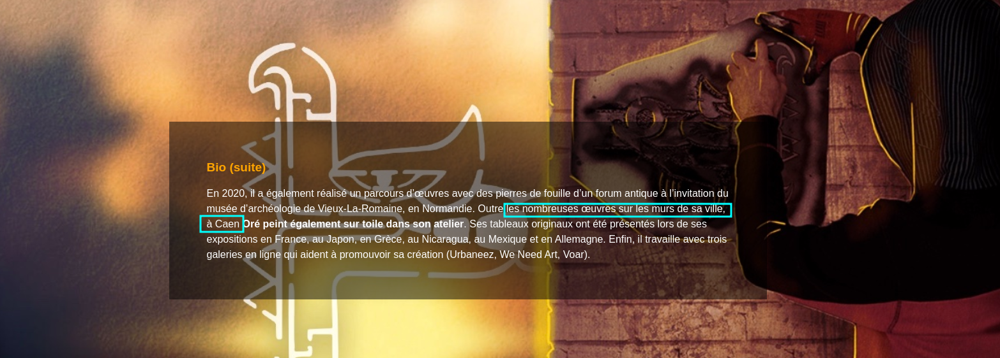
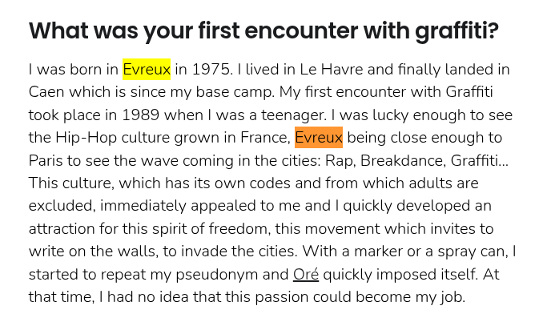
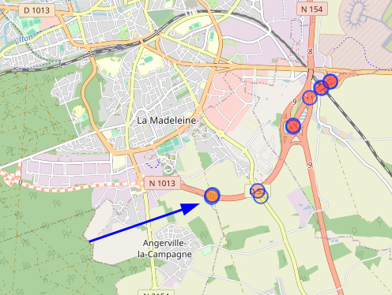
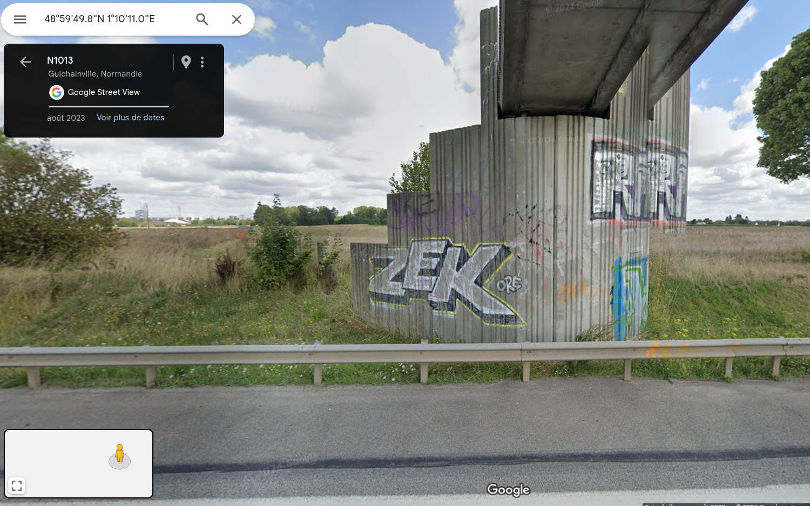
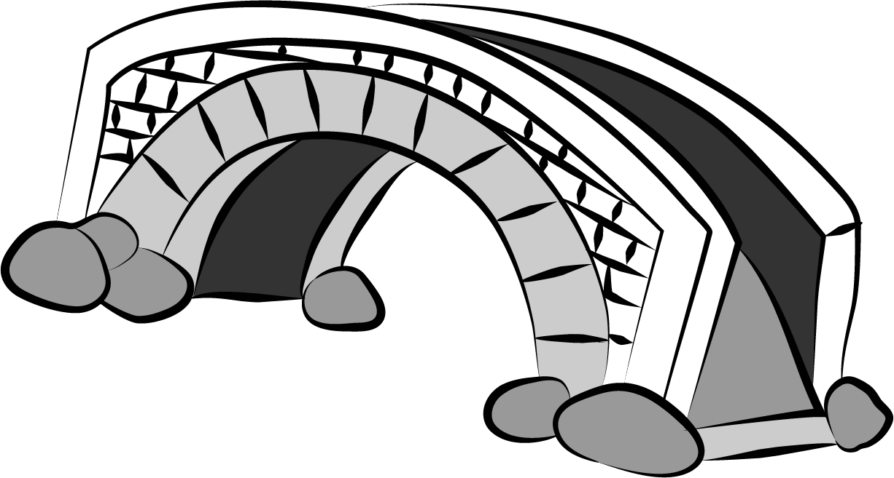

## Description
It seems that this place is more agitated than it appears. Usually empty, we have recently seen mischievous silhouettes roaming around it, seeming to meet here, for some unknown purpose...

The flag will be the [Overpass Turbo](https://overpass-turbo.eu/) node ID corresponding to the bridge.

**Author : Baptiste Martinez** 



## Solution 
**(Suggested by Sto)**

### Backstory : 
While searching for the best bridge to use for this edition’s bridge challenge, we received this picture from Baptiste. We immediately thought that if we could actually solve it and locate that bridge, it would be the perfect fit.
Even we didn’t have the solution at first, we worked through it just like you did.
Kudos to Paco for his final insight about the RN that helped us solve it ^^ 

### Walkthrough :
We first start with a generic Google reverse image search on the bridge and the entire image, but neither yield any results.

Nevertheless, when we perform a reverse image search on the graffiti, we find interesting results.



It is a similar image entitled : _"On the motorway... Dédié à Zek décédé en 2004. Repose En Paix. #oré #ore_urban_art #graffiti #streetart #lettrage #quetzalcoatl"_


    Link : https://www.flickr.com/photos/ore-el-quetzalcoatl/19986846168/in/photostream/

This translates into : "On the motoway.. Dedicated to Zek who passed away in 2004. RIP #oré #ore_urban_art #graffiti #streetart #lettrage #quetzalcoatl" 

We hence learn that there is a graffiti which represents a tribute to someone who passed away, called Zek. Hence, we will have to find the motorway where the graffiti was drawn.

We check the author profile. Oré is a street art artist. and on his website https://www.artore.org/, it is highlighted that he usually does street art in Normandie, France (precisely in Caen) as underlined below.
 

We also observe Oré's social media links at the end of the page, and we visit his Facebook and Urbaneez pages.

We find the [same image posted on Oré art facebook page](https://www.facebook.com/photo/?fbid=964487300257629&set=a.859825067390520), and one of the comments confirms the fact that it is at his hometown. 

As Urbaneez also has some interviews of artists, we perform a Google Dork with the keywords "oré" "urbaneez" and we find the [following article](https://urbaneez.art/fr/magazine/ore-i-like-to-play-with-urban-space-and-use-it-as-my-studio?srsltid=AfmBOoplsropYAM-Jw76mKPuNpFNvD34w6USCR1hD_snKdBH2TAJWIy-) mentioning that Oré's hometown is actually Évreux (which is in Normandie) as highlightd in the following screenshot.



So, our target motorway should be either at Caen or Évreux.

Let’s go back to our initial image and put all the elements together.

Our bridge is located on a **motorway**, that has **two lanes** (so should be a **national road** (or RN for Route Nationale in French)), **between Caen and Évreux**, and is **close to the city** as there are several graffiti tags on it. 

We list the motorways that match these criteria : 
- Passing through Caen:
    - RN13
    - RN814
- Passing through Évreux:
    - RN13
    - RN1013

Moreover, we check them one by one to find the most matching scenery of the surrounding fields, and we see that the **RN1013** is the one that represents the best match.

Finally, we perform the following Overpass Turbo query in order to find all the bridges crossing the `N1013` : 
```
[out:json];{{geocodeArea:Normandie,France}}->.searchArea;
nwr["ref"="N 1013"]["highway"](area.searchArea)->.n1013;
nwr["bridge"]["layer"](area.searchArea)->.bridges;
nwr.bridges(around.n1013:0);
(._;>;);out qt;
```
This gives all the bridges and we check at first the one that is among the fields and the closest to the city. 



It correspponds to the following [node](https://www.openstreetmap.org/way/452508047#map=19/48.997172/1.169718).

And when we check it in on Google Maps, we find [our desired bridge](https://www.google.com/maps/@48.9972625,1.1697272,3a,75y,31.96h,83t/data=!3m7!1e1!3m5!1sglqwiS4lm-Si6miaFLnzgA!2e0!6shttps:%2F%2Fstreetviewpixels-pa.googleapis.com%2Fv1%2Fthumbnail%3Fcb_client%3Dmaps_sv.tactile%26w%3D900%26h%3D600%26pitch%3D7.002112392081457%26panoid%3DglqwiS4lm-Si6miaFLnzgA%26yaw%3D31.955051842638305!7i16384!8i8192?entry=ttu&g_ep=EgoyMDI1MDQwMi4xIKXMDSoJLDEwMjExNDU1SAFQAw%3D%3D
) with the Zek graffiti.


Finally, as our flag is the Overpass Turbo node that corresponds to our bridge, the flag will be `N0PS{Way_452508047}`.

------

And that, kids, is how we found the bridge ^^

<div align="center">
  
</div>