## Invaders Challenge Writeup

### Description

We've found an old-school space-invaders game on a PwnTopia server, but it seems to be unusually large in size. Maybe something is hidden inside of it...

_Note: This is a Windows challenge, so having a Windows VM might be helpful._
_Security Warning_: Windows SmartScreen may flag the executable as unrecognized or potentially unsafe. This is not due to malware, but because the binary is not digitally signed by a trusted certificate authority. If you're unsure run it inside a virtual machine.

**Author: CaptWake**

### Solution

#### Initial Analysis

Running the executable program reveals a Space Invaders-like game. After some basic checks, we determine that the game was developed using the **Godot engine**.

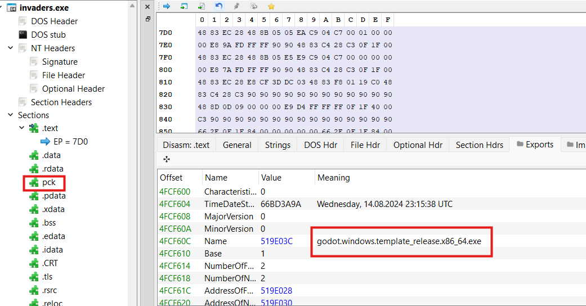

#### Extracting Game Files

To extract the game files from the executable, we use the `gdre_tools.exe` utility. The following command extracts the embedded resources:

```sh
.\gdre_tools.exe --headless --extract=.\invaders.exe
```

Once extracted, we need to decompile the relevant Godot scripts. The most interesting script appears to be **game.gdc**. We can decompile it using:

```sh
 .\gdre_tools.exe --headless --bytecode="4.3.0" --decompile=.\invaders\game\game.gdc
```

#### Understanding the Godot Script

Examining the decompiled script, we find that each time the game starts, it decrypts a payload and writes it into a file named **gamedata**. After extracted this file, we can use **Detect It Easy (DIE)** to confirm that this file is a **PE (Portable Executable)**.

Running this extracted executable prompts for a **key**, so our next step is to reverse-engineer the mechanism that validates this key.

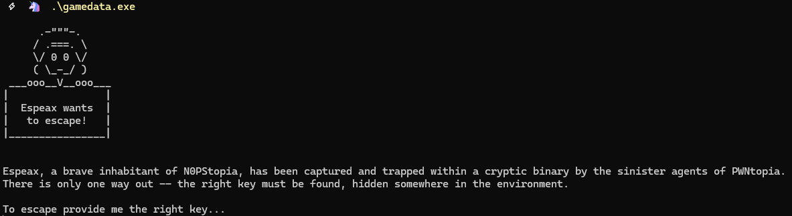

#### Reversing the Main Executable

Using `capa` on the main executable, we find evidence of encryption and obfuscation techniques, including **classical encryption routines, XOR, and Base64**. This suggests that searching for the flag directly in the executable's strings won't be effective.

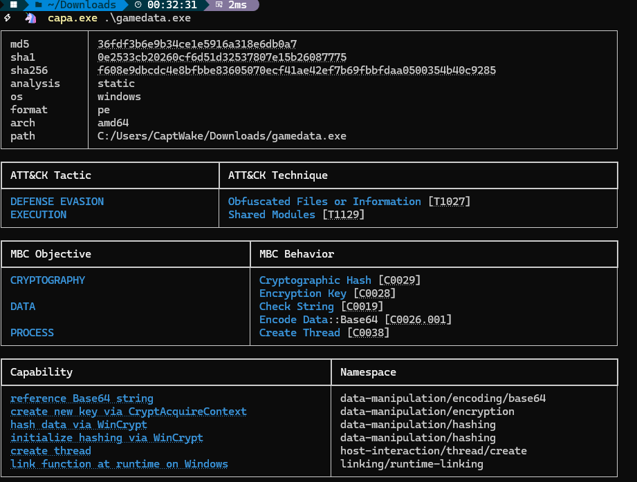

##### Identifying Anti-Debugging Techniques

Using IDA, we discover a **TLS callback** executing before the main function. This callback implements a basic anti-debugging technique using the `IsDebuggerPresent` Windows API. If a debugger is detected, the program sleeps for an extended period, making it difficult to analyze.

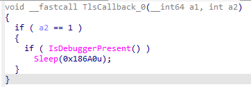


##### Investigating the Main Function

Looking at the main function, we observe that:

1. The program **creates two events** and then waits for them to be signaled.
2. This explains why the program appears **stuck waiting for a key**.
3. To proceed, we need to determine where these events are signaled.

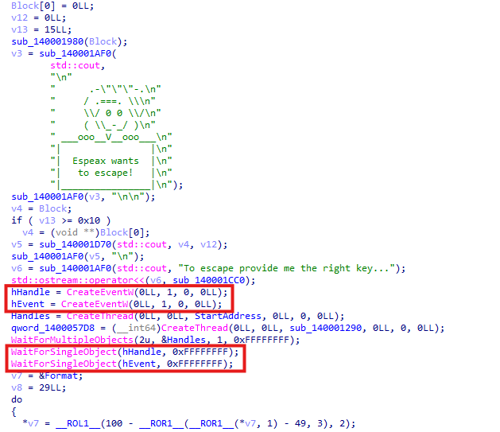

##### Analyzing the Threads

The program spawns **two threads**, but their routines appear highly obfuscated. To understand them efficiently, we use a **debugger**.

Since the program employs anti-debugging techniques, we utilize **x64dbg with ScyllaHide** to bypass them. We then set **hardware breakpoints** on the entry points of the thread routines.

##### First Thread: Key Validation

1. The first callback function verifies whether the **SHA-256 hash of a specific input matches a predefined value**.

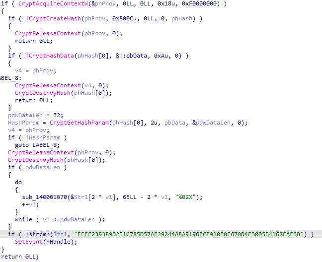

2. Interestingly, this check always succeeds, meaning this part does not introduce additional complexity.

##### Second Thread: Environmental Variable Check

1. The second validation is more complex. Examining the decompiled code, we see that **the program dynamically resolves API functions**.

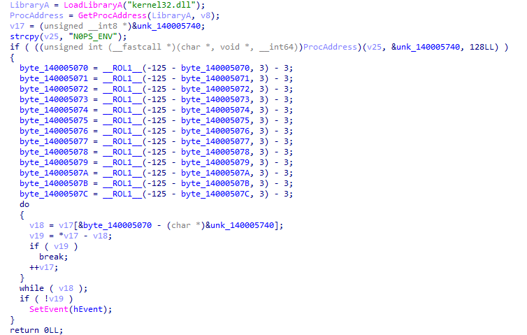

2. Using a debugger, we determine that the program calls **GetEnvironmentVariable**.

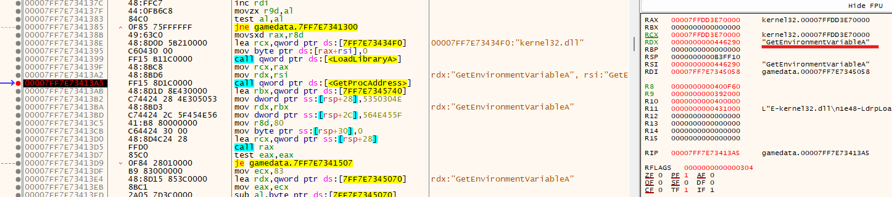

3. Following the code we see that the program is retrieving the value stored in the `N0PS_ENV` env variable.

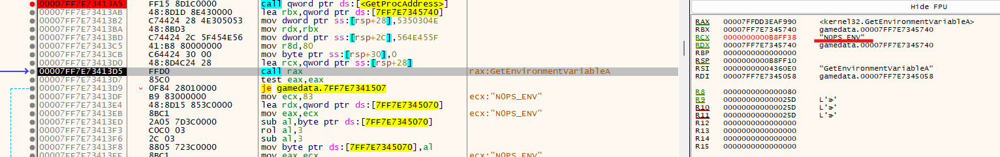

4. Then there is a basic string comparison routine the checks whether the env variable value is the expected one (`S4V3D_3SPE4X`). If it is the case, the event will be signaled, allowing the program to proceed.

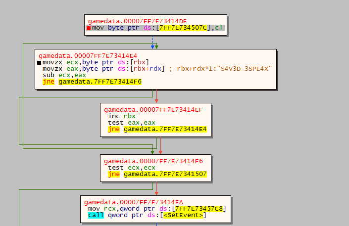

### Conclusion

To reveal the flag we need to set the `N0PS_ENV` env variable to `S4V3D_3SPE4X` and then run the executable.

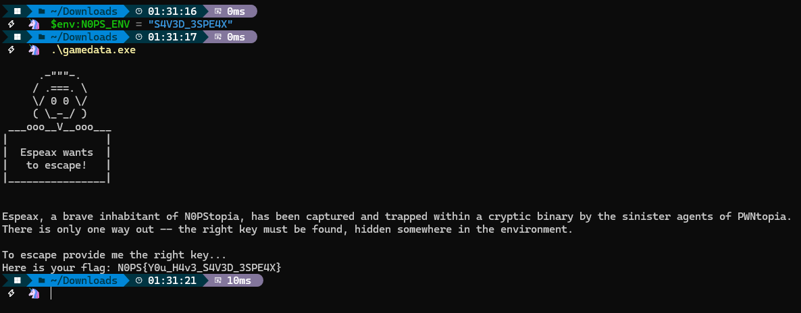

### Flag
`N0PS{Y0u_H4v3_S4V3D_3SPE4X}`