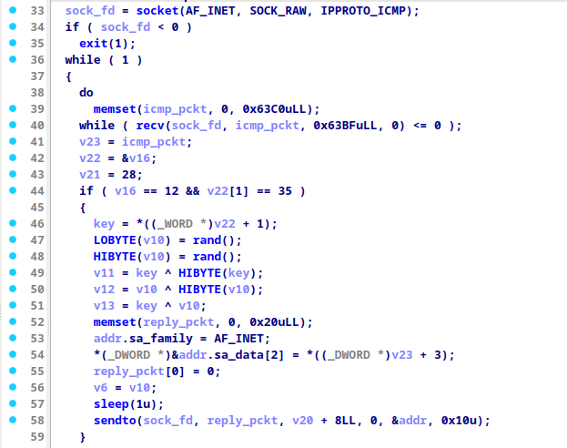
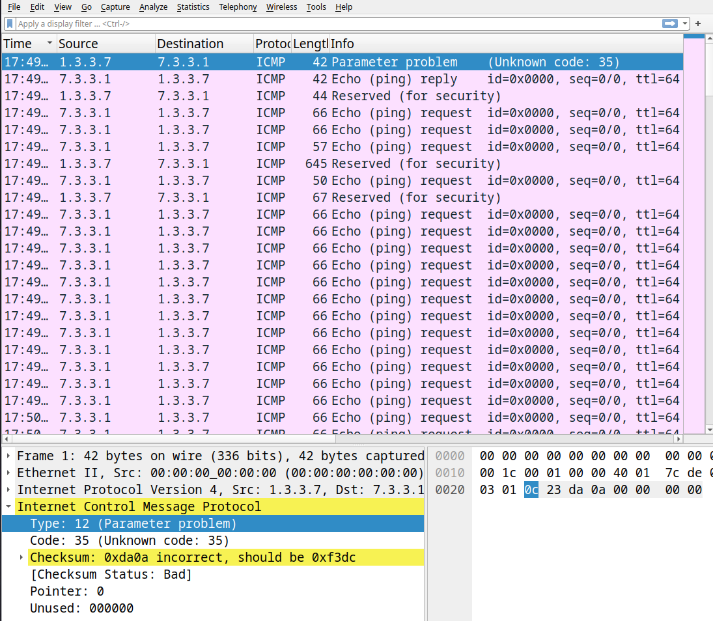
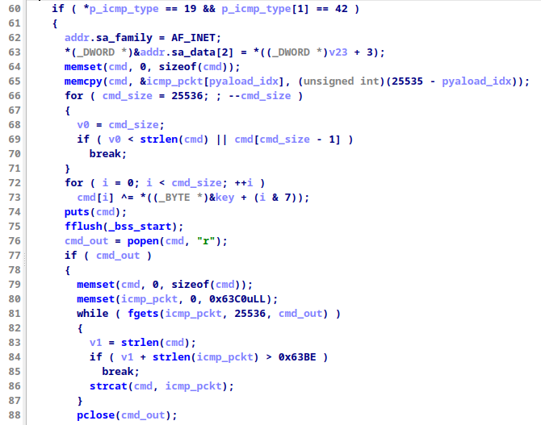
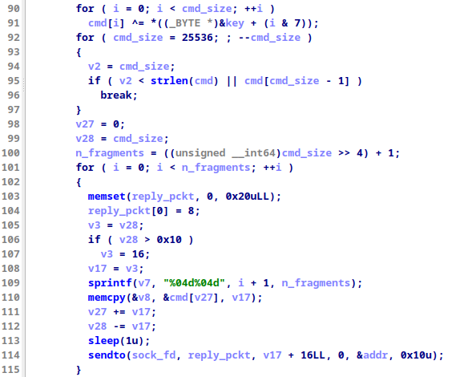

## pwntopiashl

### Description

N0PStopia has been attacked by PwnTopia!
They installed a stealthy binary on one of our servers, but we did not understand what it does!
Can you help? We saw some weird ICMP traffic during the attack, you can find attached a capture file.

**Author: algorab, CaptWake**

### Solution

In this challenge, we were given a binary executable and a PCAP file (capture.pcap) with ICMP packets recorded.
The binary appeared to be a network server that processes ICMP packets, and the PCAP contained the traffic we needed to decode. 

#### Initial Analysis

Loading the binary into IDA Free for static analysis reveals it creates a raw socket for ICMP packets with `socket(AF_INET, SOCK_RAW, IPPROTO_ICMP)`. This suggests that the server exchange ICMP packets.
Let's try to reverse the protocol. 

#### Reversing the Protocol


##### Key Scheduling
The first handler expects to receive two specific bytes in the packet (12 and 35) and if the server is gonna generate a key that will be used later. is establishing a sort of handshake.



Opening the file capture.pcap in Wireshark revealed unusual ICMP traffic, specifically we can observe from the first packet that the `12` and `35` values that we have seen in the decompiled view of IDA correspond to the `icmp type` and `icmp code` fields respectively.



After noticing this, we can infer that the IDA variable `v22` has type `icmphdr*`, as a consequence the `key` variable that stores the value `*((_WORD *)v22 + 1)` is basically storing the `checksum` field. So the key scheduling can be resembled in this way:

```C
key[0] = icmp_cksum & 0xFF;           // Lower byte of ICMP checksum
key[1] = icmp_cksum >> 8 & 0xFF;      // Upper byte of ICMP checksum
key[2] = rand();                      // Random byte 1
key[3] = rand();                      // Random byte 2
key[4] = key[0] ^ key[1];             // XOR of checksum bytes
key[5] = key[2] ^ key[3];             // XOR of random bytes
key[6] = key[0] ^ key[2];             // XOR of 1st checksum byte and 1st random byte
key[7] = key[1] ^ key[3];             // XOR of 2nd checksum byte and 2nd random byte
```

##### Command Execution
After the key is established, the server expects a special ICMP packet with `icmp type = 19` and `icmp code = 42`.

This packet should contains an encrypted payload. The server decrypts it (xoring it byte by byte) using the key from the handshake and interprets the result as a shell command as we can see in the image below. The server then executes this command and prepares the output for transmission.



##### Response Handling and Fragmentation
We see also that if the output is too big the server fragments the output of the executed command into multiple ICMP Type 8 (Echo Reply) packets. This fragmentation is manually handled by the server, and reassembly must be performed on the client side to reconstruct the full response.



##### Client implementation
Since we lack access to a live server, we rely on the provided capture.pcap to extract the flag. The flag is likely in the output of one of the executed commands, so we need to:

1. Extract the key from the handshake packet (ICMP Type 12, Code 35).

2. Decrypt the command payload from the Type 19, Code 42 packet.

3. Recover the command output.


Here is the python solution:

```python
from scapy.all import *
from sys import argv

def derive_key(checksum_request, checksum_reply):
    key = []
    key.append((checksum_request >> 8) & 0xFF)  # key[0]
    key.append(checksum_request & 0xFF)         # key[1]
    key.append((checksum_reply >> 8) & 0xFF)    # key[2]
    key.append(checksum_reply & 0xFF)           # key[3]
    key.append(key[0] ^ key[1])                 # key[4]
    key.append(key[2] ^ key[3])                 # key[5]
    key.append(key[0] ^ key[2])                 # key[6]
    key.append(key[1] ^ key[3])                 # key[7]
    return key

def decrypt_data(data, key):
    return bytes([data[i] ^ key[i % len(key)] for i in range(len(data))])

def process_pcap(pcap_file):
    packets = rdpcap(pcap_file)
    current_key = None
    checksum_request = None
    response = ""
    cmd_count = 0

    print("Processing PCAP file...\n")

    for pkt in packets:
        if ICMP in pkt:
            icmp = pkt[ICMP]

            # Key exchange request
            if icmp.type == 12 and icmp.code == 35:
                if response:
                    print(f"Response {cmd_count-1}: {response}")
                    response = ""
                checksum_request = icmp.chksum
                continue

            # Key exchange reply
            if icmp.type == 0 and icmp.code == 0 and checksum_request is not None:
                if response:
                    print(f"Response {cmd_count-1}: {response}")
                    response = ""
                checksum_reply = icmp.chksum
                current_key = derive_key(checksum_request, checksum_reply)
                print(f"Key {len(keys)}: {current_key}")
                keys.append(current_key)
                continue

            # Command packet
            if icmp.type == 19 and icmp.code == 42:
                if response:
                    print(f"Response {cmd_count-1}: {response}")
                    response = ""
                cmd_data = bytes(icmp.payload)  # Full payload after ICMP header
                cmd = decrypt_data(cmd_data, current_key).decode(errors='ignore').strip('\x00')
                print(f"Command {cmd_count}: {cmd}")
                cmd_count += 1

            # Response fragment
            if icmp.type == 8 and icmp.code == 0:
                out_data = bytes(icmp.payload)[8:]  # Skip fragment counter
                out = decrypt_data(out_data, current_key).decode(errors='ignore')
                response += out

    if response:
        print(f"Response {cmd_count-1}: {response}")

if __name__ == "__main__":
    if len(argv) != 2:
        print("Usage: python solve.py <pcap_file>")
        sys.exit(1)
    pcap_file = argv[1]
    process_pcap(pcap_file)
```

Unfortunately, after running the script we still don't get the flag, however we can observe that the last executed command is:
```
Command: b'cat .secret | openssl enc -aes-256-cbc -a -salt -pbkdf2 -pass pass:we_pwned_nops'
```
Here is the response:
```
Response: U2FsdGVkX1+sDd5g4JCxThLBMo/IsCKiwxriZAOdcfL7Y8cejGFLo3jpAiyuyx7o
```

Luckily we have all the inforation to decrypt the message and retrieve the original plaintext, we have  to simply run:
```bash
echo "U2FsdGVkX1+sDd5g4JCxThLBMo/IsCKiwxriZAOdcfL7Y8cejGFLo3jpAiyuyx7o" | openssl enc -aes-256-cbc -a -d -salt -pbkdf2 -pass pass:we_pwned_nops
```

And we finally get the flag!
```
N0PS{v3Ry_s734lThY_1cMP_sh3Ll}
```
