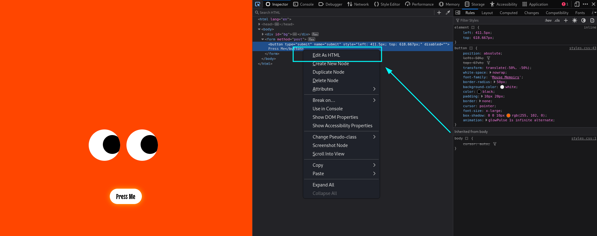
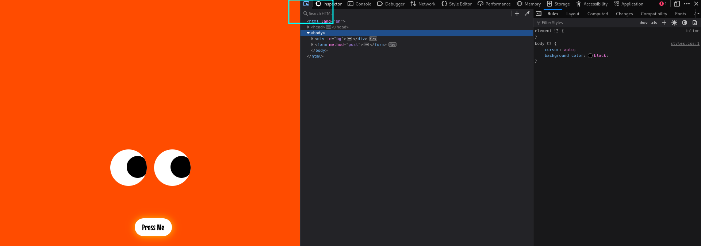
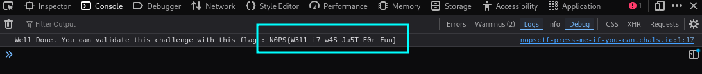

## Press Me If You Can

### Description

"Stop chasing me!" said the button.
"We can't. It's our job."

Trapped in WebTopia on a page with no way out, except for the fleeing button. Can you break free?

**Author: Sto**

### Solution

The solution idea and the goal of the challenge remain the same. The difference is that we aim to approach this in a softer way by focusing on the browser's functionalities.

First, we visit the challenge page and open the developer console (shortkey `Ctrl + Shift + C` in Chrome and Firefox).. 
Then, in the Inspector tab, select the button and add an `id` to it. To achieve that, we can the "Edit as HTML" option and add the `id="JojoButton"` to the button. 

Moreover, let's delete the final `disable` argument from the button attributes. You can do that my directly removing it from the HTML code, or by executing `document.getElementById('JojoButton').disabled = false;` in the Console tab.

Finally, we select the cursor icon that allows you to pick HTML elements.

Now, try clicking the button.
 (else we can perform this in the console tab by performing the query `document.getElementById('JojoButton').click();`)  

We see that a request is correctly made and in the Console tab, we observe our flag being logged. 
 

### Flag
`N0PS{W3l1_i7_w4S_Ju5T_F0r_Fun}`
